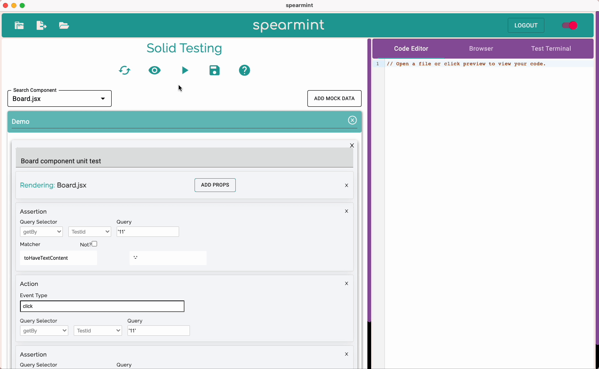

  🍃 ✨ spearmint v13 ✨ 🍃

Spearmint helps developers easily create functional Accessibility, Endpoint, GraphQL, Puppeteer, React, Hooks, Redux, Svelte, Vue, Security, and Solid.js tests without writing any code. It dynamically converts user inputs into executable Jest test code by using DOM query selectors provided by @testing-library.

# Installation

Please download spearmint from our [website](https://www.spearmintjs.com/)

# How to use in development mode

Please refer to [README-dev.md](https://github.com/open-source-labs/spearmint/blob/main/README-dev.md)

 

# How it works

1. Open the folder of the repo you'd like to create tests for, then choose the framework/type of test you'd like to create.
   <picture>
      <source media="(prefers-color-scheme: dark)" srcset="public/LoadProjectDemo.gif">
      <source media="(prefers-color-scheme: light)" srcset="public/LoadProjectDemo.gif">
      
   </picture>

2. Utilize our auto-complete, drop-down options, and tooltips features to easily create arrangement, action, and assertion test statements for React, Vue, Svelte, and Solid; reducer, action creator, asynchronous action creator, and middleware test statements for Redux; and hooks, context, endpoint, and GraphQL test statements.
3. Spearmint will then convert user input to dynamically generate a test file in the Code Editor.
   <picture>
      <source media="(prefers-color-scheme: dark)" srcset="public/ShowDemo.gif">
      <source media="(prefers-color-scheme: light)" srcset="public/ShowDemo.gif">
      
   </picture>

4. Follow the instructions in the recently added User Guide tab on the right to export and run your tests.
   <picture>
      <source media="(prefers-color-scheme: dark)" srcset="public/RunDemo.gif">
      <source media="(prefers-color-scheme: light)" srcset="public/RunDemo.gif">
      
   </picture>

5. Don't forget to select your test file from the left panel in order to manually edit the test in the Test Editor; otherwise the changes won't be reflected in the test file.
   <picture>
      <source media="(prefers-color-scheme: dark)" srcset="public/SaveDemo.gif">
      <source media="(prefers-color-scheme: light)" srcset="public/SaveDemo.gif">
      
   </picture>

# Containerization with Docker

Spearmint is now available as an OCI-compliant container image via Docker.

Windows and Linux users may access Spearmint by running a Docker image.

Please pull down the image from [Docker hub](https://hub.docker.com/repository/docker/spearmintoslabs/spearmint) if you would like to run Spearmint on Docker.

For developers: [README-dev.md](https://github.com/open-source-labs/spearmint/blob/main/README-dev.md). This containes more information specific to developers such as data systems, outlines of the application, turning on dev tools, etc.

# New features with version 0.13.0

- Working with updated versions of node and electron.

- Accessibility component fixed.

- Reinstated dev testing.

- Migrating the codebase to TypeScript

- Added documentation for future developers

 

# Iteration Roadmap

1. _Continual TypeScript Conversion:_
   - This will help with the maintainability and quality of spearmint
2. _Persistant data:_
   - There is a framework for login, including github and google, however it is not implemented
   - Adding more features to make login and user data more valuable, such as favorited or saved tests
3. _Adding more testing:_
   - Either more frameworks to test
   - Or deeper testing of existing frameworks
4. _Revamp UI for certain test cases:_
   - Some of test cases needs improvement on UI as they do not have any styling or optimal user experience

 

# Known Bugs

1. Screen reader for Accessibilty can turn on and off but does not read.

 

# The Spearmint Team

|     Developed By      |                                                                                                                                                         |                                                                                                                                                             |
| :-------------------: | :-----------------------------------------------------------------------------------------------------------------------------------------------------: | :---------------------------------------------------------------------------------------------------------------------------------------------------------: |
|    Alan Richardson    |       |                  |
|       Alex Park       |             |                                                           |
|  Alfred Sta. Iglesia  |           |                   |
|     Anjanie McCoy     |          |                  |
|      Annie Shin       |            |                    |
|       Ben Kwak        |                 |                      |
|     Brandon Tran      |              |                           |
|     Chacta Brice      |         |  |
|    Charlie Maloney    |       |               |
|    Chen 'Chloe' Lu    |             |                      |
|      Chloe Aribo      |           |                   |
|      Chris Cheng      |              |                      |
|  Cornelius Phanthanh  |           |            |
|     Danny Wallace     |            |                    |
|      Dave Franz       |             |                    |
|       David Kim       |               |                    |
|   DeriAnte Sinclair   |                |   |
| Dieu 'Dieunity' Hyunh |              |                    |
|     Erik Komatsu      |             |                  |
|       Erik Park       |             |                     |
|     Erika Collins     |  |        |
|     Evan Berghoff     |              |                  |
|      Evan Decker      |            |         |
|    Gabriel Christo    |           |      |
|        Huy Bui        |               |                       |
|   Jasmine Gonzalez    |          |                  |
|      Joseph Nagy      |            |                   |
|      Johnny Lim       |            |                                  |
|       Judy Song       |             |                     |
|      Julie Beak       |          |                     |
|      Justin Baik      |               |                   |
|     Karen Pinilla     |          |                 |
|       Li Cheng        |           |             |
|   Linda Wishingrad    |                |               |
|        Luis Lo        |            |                       |
|  Mahmoud 'Mo' Hmaidi  |            |             |
|      Max Bromet       |               |          |
|   Max Weisenberger    |             |                     |
|      Mike Coker       |               |                    |
|       Mina Koo        |              |                       |
|     Myles Tsutsui     |          |                  |
|   Natlyn Phomsvanh    |               |                                  |
|     Nicolas Pita      |           |                   |
|     Owen Eldridge     |          |                 |
|      Rachel Yoo       |       |                    |
|    Rawan Bairouti     |         |                 |
|    Ruzeb Chowdhury    |                 |                |
|    Sean Haverstock    |       |               |
|       Sean Yoo        |              |                      |
|      Sharon Zhu       |            |                     |
|      Sieun Jang       |             |                        |
|   Terence Petersen    |             |              |
|    Tolan Thornton     |            |                 |
|    Tristen Wastell    |              |                |
|     Troy Witonsky     |             |                  |
|    Tyler Martinez     |           |          |
|      William Lee      |        |                 |
|      Wilson Tran      |           |                  |
|      Yeunha Kim       |           |                   |

